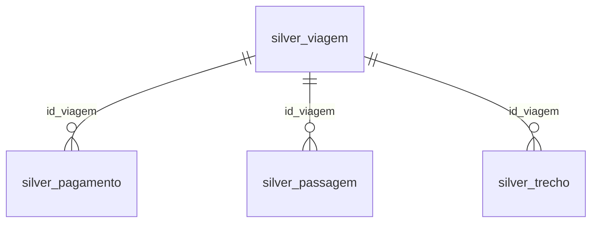

# Pipeline de Dados - Viagens a Serviço (Portal da Transparência)

Pipeline de dados de ponta a ponta que baixa, limpa e transforma os dados abertos de
**Viagens a Serviço** do Portal da Transparência do Governo Federal (2025) em métricas
de negócio confiáveis, seguindo a **Arquitetura Medallion** (Raw → Silver → Gold).

## 1. Qual problema ele resolve

Os dados de viagens a serviço são publicados pelo governo em formato bruto: CSVs com
separador `;`, encoding `latin-1`, valores monetários em texto com vírgula decimal e
datas em `DD/MM/AAAA`. Isso torna a análise direta inviável e propensa a erro.

Este projeto automatiza todo o processo de:
- **Extrair** os dados sem intervenção manual, preservando o histórico original (Raw);
- **Limpar e tipar** os dados, com integridade referencial entre as tabelas (Silver);
- **Responder perguntas de negócio reais** com métricas agregadas e gráficos (Gold),
  apoiando a transparência e a tomada de decisão sobre gastos públicos com viagens.

## 2. Técnicas e tecnologias utilizadas

- **Python** (pandas) para leitura e transformação dos dados em blocos (chunks);
- **MySQL** para persistência das 3 camadas (Raw, Silver, Gold), com `PRIMARY KEY`,
  `FOREIGN KEY`, `CHECK`, `NOT NULL` e `UNIQUE` na camada Silver;
- **SQL avançado** (CTE, JOIN, GROUP BY, VIEW) para construir a camada Gold;
- **Jupyter Notebook** + **matplotlib** para a análise final e visualização;
- **gdown** para automatizar o download do arquivo `.zip` a partir do Google Drive;
- Variáveis de ambiente (`.env`) para manter credenciais fora do código-fonte.

### Arquitetura do pipeline


### Modelo relacional (camada Silver)



## 3. Como executar

### Pré-requisitos
- Python 3.10+
- MySQL 8.0+ em execução

### Passo a passo

```bash
# 1) Clonar o repositório e entrar na pasta
git clone <url-do-seu-repositorio>
cd desafio_transparencia

# 2) Instalar as dependências
pip install -r requirements.txt

# 3) Configurar as credenciais
cp .env.example .env
# edite o .env com o usuário/senha do seu MySQL

# 4) Configurar o ID do arquivo no Google Drive
# abra config.py e cole o ID em DRIVE_FILE_ID

# 5) Criar o banco e as 8 tabelas
mysql -u root -p < 0_criar_banco.sql

# 6) Rodar o pipeline, na ordem
python 1_extrair.py        # baixa o .zip, extrai os CSVs e carrega a camada Raw
python 2_transformar.py    # limpa, tipa e carrega a camada Silver

# 7) Abrir o notebook da camada Gold
jupyter notebook 3_analise.ipynb
```

Tanto `1_extrair.py` quanto `2_transformar.py` são **idempotentes**: podem ser
executados quantas vezes forem necessárias sem duplicar dados (as tabelas são
truncadas antes de cada carga).

## 4. Perguntas de negócio respondidas

**Direto na camada Silver:**
1. Quais os 5 órgãos com maior custo total de viagens?
2. Qual a viagem de maior duração e qual seu custo total?
3. Qual o meio de transporte mais usado nos trechos?

**Via camada Gold (tabelas `gold_destino_uf` / `gold_pagamento_tipo` e suas views):**
4. Quais os 3 destinos (UF) com maior custo médio por viagem?
5. Qual o tipo de pagamento com maior valor médio?
6. Qual UF de destino aparece em mais trechos?

*(bônus: qual órgão pagador concentrou o maior valor total pago)*

## 5. Principais conclusões e insights

- O gasto com viagens está concentrado em poucos órgãos superiores — qualquer política
  de redução de custo teria mais impacto se focada nesse grupo restrito.
- Duração da viagem e custo total **não** andam necessariamente juntos: a viagem mais
  longa do semestre não foi a mais cara.
- O transporte aéreo domina os deslocamentos a serviço, coerente com as distâncias
  continentais do país.
- Destinos com maior custo médio tendem a ser UFs mais distantes dos grandes polos
  (passagens mais caras), apontando oportunidades de negociação de tarifas.
- Pagamentos de passagem têm o maior ticket médio entre os tipos de pagamento.
- O Distrito Federal concentra o maior número de trechos com destino, refletindo o
  fluxo natural de viagens administrativas para Brasília.

(A análise completa, com tabelas e gráficos, está em `3_analise.ipynb`.)

## 6. Melhorias futuras

- Orquestrar o pipeline com Airflow (ou similar), rodando automaticamente a cada nova
  atualização do Portal da Transparência;
- Incluir séries históricas de anos anteriores para análises de tendência ao longo do
  tempo;
- Expor a camada Gold em um dashboard (Power BI, Metabase ou Streamlit) para consumo
  direto pelas equipes de controle interno;
- Adicionar testes automatizados (ex.: `pytest`) para as funções de conversão de tipos.

## 7. Estrutura do repositório

```
desafio_transparencia/
├── 0_criar_banco.sql       # Fase 0 - cria o banco e as 8 tabelas
├── 1_extrair.py            # Fase 1 - download + carga da camada Raw
├── 2_transformar.py        # Fase 2 - limpeza/tipagem -> camada Silver
├── 3_analise.ipynb         # Fase 3 - camada Gold + perguntas de negócio + gráficos
├── banco.py                # conexão e funções utilitárias do MySQL
├── config.py               # parâmetros do projeto + leitura do .env
├── .env.example            # modelo de credenciais
├── .gitignore
├── requirements.txt
└── README.md
```